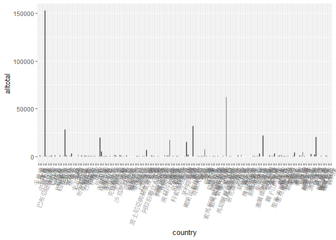
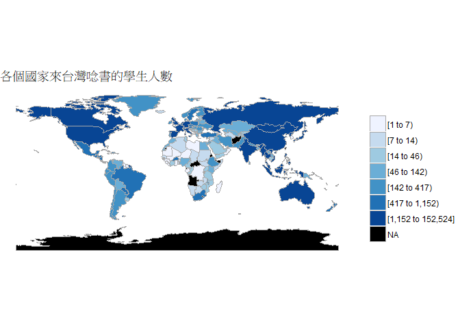
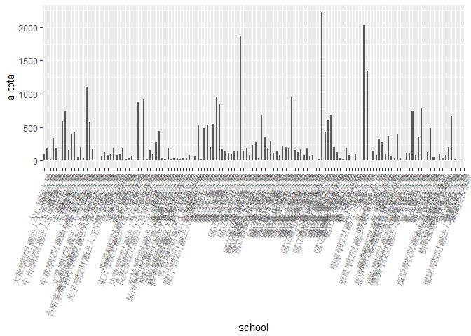
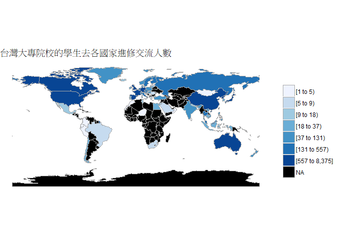
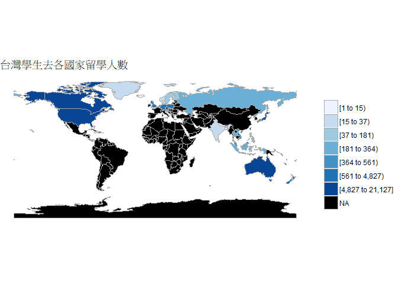

106-2 大數據分析方法 作業二
================
Yi-An Chen

作業完整說明[連結](https://docs.google.com/document/d/1aLGSsGXhgOVgwzSg9JdaNz2qGPQJSoupDAQownkGf_I/edit?usp=sharing)

學習再也不限定在自己出生的國家，台灣每年有許多學生選擇就讀國外的大專院校，同時也有人多國外的學生來台灣就讀，透過分析[大專校院境外學生人數統計](https://data.gov.tw/dataset/6289)、[大專校院本國學生出國進修交流數](https://data.gov.tw/dataset/24730)、[世界各主要國家之我國留學生人數統計表](https://ws.moe.edu.tw/Download.ashx?u=C099358C81D4876CC7586B178A6BD6D5062C39FB76BDE7EC7685C1A3C0846BCDD2B4F4C2FE907C3E7E96F97D24487065577A728C59D4D9A4ECDFF432EA5A114C8B01E4AFECC637696DE4DAECA03BB417&n=4E402A02CE6F0B6C1B3C7E89FDA1FAD0B5DDFA6F3DA74E2DA06AE927F09433CFBC07A1910C169A1845D8EB78BD7D60D7414F74617F2A6B71DC86D17C9DA3781394EF5794EEA7363C&icon=..csv)可以了解103年以後各大專院校國際交流的情形。請同學分析以下議題，並以視覺化的方式呈現分析結果，呈現103年以後大專院校國際交流的情形。

來台境外生分析
--------------

### 資料匯入與處理

``` r
#資料匯入
library(jsonlite)
library(readr)
library(dplyr)
c103<-fromJSON("https://quality.data.gov.tw/dq_download_json.php?nid=6289&md5_url=25f64d5125016dcd6aed42e50c972ed0")
s103<-fromJSON("https://quality.data.gov.tw/dq_download_json.php?nid=6289&md5_url=a6d1469f39fe41fb81dbfc373aef3331")
c104<-fromJSON("https://quality.data.gov.tw/dq_download_json.php?nid=6289&md5_url=4d3e9b37b7b0fd3aa18a388cdbc77996")
s104<-fromJSON("https://quality.data.gov.tw/dq_download_json.php?nid=6289&md5_url=8baeae81cba74f35cf0bb1333d3d99f5")
c105<-fromJSON("https://quality.data.gov.tw/dq_download_json.php?nid=6289&md5_url=19bedf88cf46999da12513de755c33c6")
s105<-fromJSON("https://quality.data.gov.tw/dq_download_json.php?nid=6289&md5_url=1a485383cf9995da679c3798ab4fd681")
c106<-fromJSON("https://quality.data.gov.tw/dq_download_json.php?nid=6289&md5_url=50e3370f9f8794f2054c0c82a2ed8c91")
s106<-fromJSON("https://quality.data.gov.tw/dq_download_json.php?nid=6289&md5_url=883e2ab4d5357f70bea9ac44a47d05cc")
peopleamountcount105 <- read_csv("C:/Users/yian/Desktop/peopleamountcount105.csv", 
                                 locale = locale(encoding = "BIG5"))
Student_RPT_07 <- read_csv("C:/Users/yian/Desktop/Student_RPT_07.csv", 
                           locale = locale(encoding = "BIG5"))
#peopleamountcount105,Student_RPT_07已在excel整理好資料表才匯入
```

### 哪些國家來台灣唸書的學生最多呢？

``` r
#103資料整理
for(i in 3:11){
  c103[,i]<-
  as.numeric(c103[,i])
}
newc103<-c103%>%
  mutate("total"=rowSums(c103[3:11],na.rm = FALSE,dims = 1))%>%
  select(c("國別","total"))

#104資料整理
for(i in 3:11){
  c104[,i]<-
    as.numeric(c104[,i])
}
newc104<-c104%>%
  mutate("total"=rowSums(c104[3:11],na.rm = FALSE,dims = 1))%>%
  select(c("國別","total"))

#105資料整理
for(i in 3:11){
  c105[,i]<-
    as.numeric(c105[,i])
}
newc105<-c105%>%
  mutate("total"=rowSums(c105[3:11],na.rm = FALSE,dims = 1))%>%
  select(c("國別","total"))

#106資料整理
for(i in 3:11){
  c106[,i]<-
    as.numeric(c106[,i])
}
newc106<-c106%>%
  mutate("total"=rowSums(c106[3:11],na.rm = FALSE,dims = 1))%>%
  select(c("國別","total"))

#join國別以及每年度境外生的加總
finaldf<-full_join(newc103,newc104,by="國別")
finaldf<-full_join(finaldf,newc105,by="國別")
finaldf<-full_join(finaldf,newc106,by="國別")
colnames(finaldf)<-c("country","t103","t104","t105","t106")
finaldf[is.na(finaldf)]<-0

#新增一個欄位加總103-106年的人數並排序
finaldf<-finaldf%>%
  mutate("alltotal"=rowSums(finaldf[2:5],na.rm = FALSE,dims = 1))%>%
  arrange(desc(alltotal))

#最多人來台灣念書的國家
library(knitr)
kable(head(finaldf,1))
```

| country  |   t103|   t104|   t105|   t106|  alltotal|
|:---------|------:|------:|------:|------:|---------:|
| 中國大陸 |  33288|  41951|  41981|  35304|    152524|

### 前十名的國家與總人數

``` r
kable(head(finaldf,10))
```

| country  |   t103|   t104|   t105|   t106|  alltotal|
|:---------|------:|------:|------:|------:|---------:|
| 中國大陸 |  33288|  41951|  41981|  35304|    152524|
| 馬來西亞 |  13385|  15054|  16311|  17281|     62031|
| 香港     |   6286|   8233|   8660|   8761|     31940|
| 日本     |   5816|   6455|   7542|   8387|     28200|
| 越南     |   4005|   4459|   5342|   7864|     21670|
| 澳門     |   4723|   5152|   5286|   5141|     20302|
| 印尼     |   3559|   4454|   5154|   6453|     19620|
| 南韓     |   3587|   4062|   4575|   4724|     16948|
| 美國     |   3328|   4003|   3701|   3814|     14846|
| 泰國     |   1535|   1591|   1771|   2138|      7035|

### 哪間大學的境外生最多呢？

``` r
#整理103-106年資料
s103$`非學位生-大陸研修生`<- gsub("…","0",s103$`非學位生-大陸研修生`)
s104$`非學位生-大陸研修生`<- gsub("…","0",s104$`非學位生-大陸研修生`)
for(n in 4:12){
  s103[,n]<-
    as.numeric(s103[,n])
}
news103<-s103%>%
  mutate("total"=rowSums(s103[4:12],na.rm = FALSE,dims = 1))%>%
  select(c("學校名稱","total"))

#104
for(n in 4:12){
  s104[,n]<-
    as.numeric(s104[,n])
}
news104<-s104%>%
  mutate("total"=rowSums(s104[4:12],na.rm = FALSE,dims = 1))%>%
  select(c("學校名稱","total"))%>%
  filter(學校名稱!="無法區分校別")

#105
for(n in 4:12){
  s105[,n]<-
    as.numeric(s105[,n])
}
news105<-s105%>%
  mutate("total"=rowSums(s105[4:12],na.rm = FALSE,dims = 1))%>%
  select(c("學校名稱","total"))%>%
  filter(學校名稱!="無法區分校別")

#106
for(n in 4:12){
  s106[,n]<-
    as.numeric(s106[,n])
}
news106<-s106%>%
  mutate("total"=rowSums(s106[4:12],na.rm = FALSE,dims = 1))%>%
  select(c("學校名稱","total"))%>%
  filter(學校名稱!="無法區分校別")

#join學校名稱以及每年度境外生的加總
sfinal<-full_join(news103,news104,by="學校名稱")
sfinal<-full_join(sfinal,news105,by="學校名稱")
sfinal<-full_join(sfinal,news106,by="學校名稱")
colnames(sfinal)<-c("school","t103","t104","t105","t106")

#新增一個欄位加總103-106年的人數並排序
sfinal[is.na(sfinal)]<-0
sfinal<-sfinal%>%
  mutate("alltotal"=rowSums(sfinal[2:5],na.rm = FALSE,dims = 1))%>%
  arrange(desc(alltotal))

#最多境外生讀的學校
knitr::kable(head(sfinal,1))
```

| school           |  t103|  t104|  t105|  t106|  alltotal|
|:-----------------|-----:|-----:|-----:|-----:|---------:|
| 國立臺灣師範大學 |  4648|  5328|  5709|  6428|     22113|

### 前十名的大學與總人數

``` r
knitr::kable(head(sfinal,10))
```

| school           |  t103|  t104|  t105|  t106|  alltotal|
|:-----------------|-----:|-----:|-----:|-----:|---------:|
| 國立臺灣師範大學 |  4648|  5328|  5709|  6428|     22113|
| 國立臺灣大學     |  3800|  4514|  4817|  5068|     18199|
| 中國文化大學     |  4137|  4188|  4046|  3703|     16074|
| 銘傳大學         |  3452|  4152|  4159|  4294|     16057|
| 淡江大學         |  2986|  3254|  3727|  3920|     13887|
| 國立政治大學     |  2705|  2871|  2989|  3061|     11626|
| 國立成功大學     |  2385|  2554|  2864|  3179|     10982|
| 輔仁大學         |  2276|  2271|  2518|  2434|      9499|
| 逢甲大學         |  2032|  2479|  2440|  2523|      9474|
| 中原大學         |  1353|  1703|  1995|  2611|      7662|

### 各個國家來台灣唸書的學生人數條狀圖

``` r
library(ggplot2)
ggplot()+
  geom_bar(data = finaldf
           ,aes(x=country,y=alltotal)
           ,stat = 'identity'
           ,width = 0.5
           ,position = position_dodge(1.5))+
  theme(axis.text.x = element_text(angle = 70, hjust = 1))
```



### 各個國家來台灣唸書的學生人數面量圖

``` r
library(readr)
CountriesComparisionTable <- read_csv("C:/Users/yian/Desktop/CountriesComparisionTable.csv")
colnames(CountriesComparisionTable)<-c("ISO3","english","country")
joindf<-inner_join(finaldf,CountriesComparisionTable,by="country")
joindf<-joindf%>%
  select("region"="english","value"="alltotal")%>%
  filter(region!="Unmatch")%>%
  group_by(region)%>%
  summarise(value=sum(value))
  
library(choroplethr)
library(choroplethrMaps)
library(plotly)
drawpic<-country_choropleth(joindf,title="各個國家來台灣唸書的學生人數")
drawpic
```



台灣學生國際交流分析
--------------------

### 資料匯入與處理

``` r
#資料已在最開始匯入
student103<-Student_RPT_07%>%
  filter(`學年度`==103)%>%
  select("學校名稱","對方學校(機構)國別(地區)","本國學生出國進修、交流人數(小計)")
colnames(student103)<-c("school","country","total")

#103
sc103<-student103%>%   #以國家分組
  group_by(country)%>%
  summarise(total103=sum(total))
ss103<-student103%>%   #以學校分組
  group_by(school)%>%
  summarise(total103=sum(total))

#104
student104<-Student_RPT_07%>%
  filter(`學年度`==104)%>%
  select("學校名稱","對方學校(機構)國別(地區)","本國學生出國進修、交流人數(小計)")
colnames(student104)<-c("school","country","total")
sc104<-student104%>%   #以國家分組
  group_by(country)%>%
  summarise(total104=sum(total))
ss104<-student104%>%   #以學校分組
  group_by(school)%>%
  summarise(total104=sum(total))

#分別合併以國家分組、以學校分組的103104dataframe
studentc103104<-full_join(sc103,sc104,by="country")
studentc103104[is.na(studentc103104)]<-0

#103104年度學生出國目的地和總數
studentc103104<-studentc103104%>%   
  mutate("alltotal"=rowSums(studentc103104[2:3],na.rm = FALSE,dims = 1))%>%
  arrange(desc(alltotal))
students103104<-full_join(ss103,ss104,by="school")
students103104[is.na(students103104)]<-0

#103104年度出國交流學校的學生總數
students103104<-students103104%>%   
  mutate("alltotal"=rowSums(students103104[2:3],na.rm = FALSE,dims = 1))%>%
  arrange(desc(alltotal))
```

### 台灣大專院校的學生最喜歡去哪些國家進修交流呢？

``` r
knitr::kable(head(studentc103104,1))
```

| country  |  total103|  total104|  alltotal|
|:---------|---------:|---------:|---------:|
| 中國大陸 |      4211|      4164|      8375|

### 前十名的國家與總人數

``` r
knitr::kable(head(studentc103104,10))
```

| country  |  total103|  total104|  alltotal|
|:---------|---------:|---------:|---------:|
| 中國大陸 |      4211|      4164|      8375|
| 日本     |      3419|      3723|      7142|
| 美國     |      2134|      2293|      4427|
| 南韓     |       799|      1251|      2050|
| 大陸地區 |       716|       800|      1516|
| 德國     |       705|       761|      1466|
| 法國     |       594|       664|      1258|
| 英國     |       370|       372|       742|
| 加拿大   |       340|       349|       689|
| 西班牙   |       288|       354|       642|

### 哪間大學的出國交流學生數最多呢？

``` r
knitr::kable(head(students103104,1))
```

| school       |  total103|  total104|  alltotal|
|:-------------|---------:|---------:|---------:|
| 國立臺灣大學 |      1110|      1114|      2224|

### 前十名的大學與總人數

``` r
knitr::kable(head(students103104,10))
```

| school       |  total103|  total104|  alltotal|
|:-------------|---------:|---------:|---------:|
| 國立臺灣大學 |      1110|      1114|      2224|
| 淡江大學     |       958|      1080|      2038|
| 國立政治大學 |       858|      1018|      1876|
| 逢甲大學     |       612|       734|      1346|
| 元智大學     |       444|       662|      1106|
| 國立臺北大學 |       452|       504|       956|
| 國立交通大學 |       446|       505|       951|
| 東海大學     |       481|       450|       931|
| 東吳大學     |       426|       447|       873|
| 國立成功大學 |       372|       474|       846|

### 台灣大專院校的學生最喜歡去哪些國家進修交流條狀圖

``` r
ggplot()+
  geom_bar(data = students103104
           ,aes(x=school,y=alltotal)
           ,stat = 'identity'
           ,width = 0.5
           ,position = position_dodge(5))+
  geom_text()+
  theme(axis.text.x = element_text(angle = 70, hjust = 1))
```



### 台灣大專院校的學生最喜歡去哪些國家進修交流面量圖

``` r
joincountry<-inner_join(studentc103104,CountriesComparisionTable,by="country")
joincountry<-joincountry%>%
  select("region"="english","value"="alltotal")%>%
  group_by(region)%>%
  summarise(value=sum(value))
drawjoincountry<-country_choropleth(joincountry,title = "台灣大專院校的學生去各國家進修交流人數")
drawjoincountry
```



台灣學生出國留學分析
--------------------

### 資料匯入與處理

``` r
#資料已在最開始匯入
colnames(peopleamountcount105)<-c("states","country","amount")
peopleamountcount105<-peopleamountcount105%>%
  select("country","amount")%>%
  arrange(desc(amount))
```

### 台灣學生最喜歡去哪些國家留學呢？

``` r
knitr::kable(head(peopleamountcount105,1))
```

| country |  amount|
|:--------|-------:|
| 美國    |   21127|

### 前十名的國家與總人數

``` r
knitr::kable(head(peopleamountcount105,10))
```

| country  |  amount|
|:---------|-------:|
| 美國     |   21127|
| 澳大利亞 |   13582|
| 日本     |    8444|
| 加拿大   |    4827|
| 英國     |    3815|
| 德國     |    1488|
| 紐西蘭   |    1106|
| 波蘭     |     561|
| 馬來西亞 |     502|
| 奧地利   |     419|

### 台灣學生最喜歡去哪些國家留學面量圖

``` r
jointwstugoout<-inner_join(peopleamountcount105,CountriesComparisionTable,by="country")
jointwstugoout<-jointwstugoout%>%
  select("region"="english","value"="amount")%>%
  group_by(region)%>%
  summarise(value=sum(value))
drawjointwstygoout<-country_choropleth(jointwstugoout,title = "台灣學生去各國家留學人數")
drawjointwstygoout
```



綜合分析
--------

請問來台讀書與離台讀書的來源國與留學國趨勢是否相同(5分)？想來台灣唸書的境外生，他們的母國也有很多台籍生嗎？請圖文並茂說明你的觀察(10分)。

-   留學以及來台和離台國家趨勢不同
    -   來台以及離台讀書第一名的國家為**中國大陸**
    -   留學國第一名的國家為**美國**

### 選出**中國大陸**離台和來台的人數作觀察

``` r
#中國大陸來台人數
knitr::kable(head(finaldf,1))
```

| country  |   t103|   t104|   t105|   t106|  alltotal|
|:---------|------:|------:|------:|------:|---------:|
| 中國大陸 |  33288|  41951|  41981|  35304|    152524|

``` r
#離台至中國大陸人數
knitr::kable(head(studentc103104,1))
```

| country  |  total103|  total104|  alltotal|
|:---------|---------:|---------:|---------:|
| 中國大陸 |      4211|      4164|      8375|

-   由上述兩個表的結果，將同年份的欄位(舉104年為例)欄位相減，得到37787。
-   但因兩國人數相差慎遠，因此上網搜尋出兩國104年度的大學生總數為：
    -   **中國大陸：2610萬人(四捨五入後)**
    -   **台灣：134萬人(四捨五入後)**

> 資料來源：[台灣104年大學生總人數](https://stats.moe.gov.tw/qframe.aspx?qno=MQA5ADEA0),[中國大陸104年大學生總人數](https://www.zhihu.com/question/29483394)

-   計算兩國境外生比率
    -   **中國大陸：0.16%(四捨五入後)**
    -   **台灣：0.31%(四捨五入後)**
-   從上述結果相比較得知，台灣學生去中國大陸的人數比例上是**大於**中國大陸來台灣的人數比例
